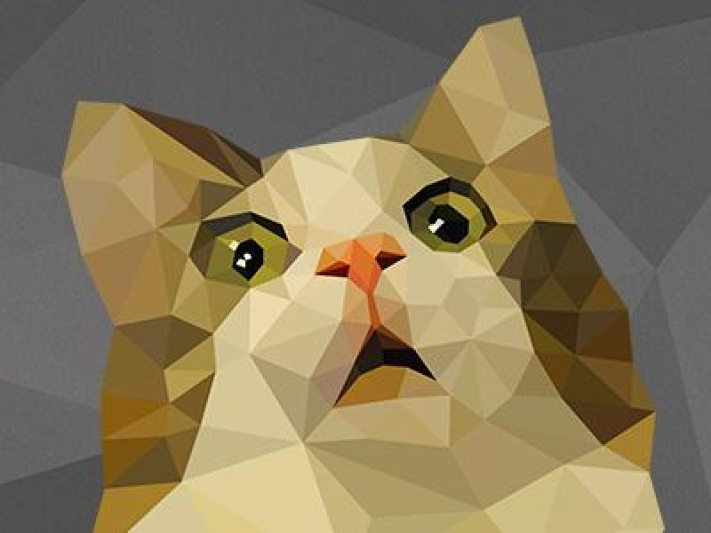

<h1 align="center">Ferguson</h1>

<p align="center">
  <br>
  :point_up_2: This is Ferguson
</p>

## Description
Ferguson is a lovely housecat for Slack.

### Features
- [x] Count the days to an upcoming event (see *[Countdown](#Countdown)* section)
- [ ] Remind the team if an event comes near
- [x] Start an election to vote for a winner
- [ ] Play a playoff-based tournament with your friends (see *[Games](#games)* section)


### Add to your workspace
Click the following button or visit *[Fergusons home](https://ferguson-bot.herokuapp.com)* 
to invite him to your workspace.

<a href="https://ferguson-bot.herokuapp.com/login">
  
</a>

## Countdown

You can tell Ferguson your upcoming events and ask him to count the remaining days.

## Voting

With the command `Let's go!` you can tell Ferguson to start a new election inside the current channel. Your team members can then vote for one winner.

## Games

Ferguson can start an interactive game which you can play with your real life friends.
It is based upon the playoff system.
You play little minigames like *"Who can drink the most shots in a minute?"* against one other person and the winner is reaching the next round.
The one who wins the final game can call oneself an *Amazing Human Slash Genius*.

<p align="center">
    
</p>

See the [instructions](docs/games.md) for more information.


## Deployment
```
npm install
npm start
```

## Hosting
`Master` branch currently deployed on [Heroku](https://ferguson-bot.herokuapp.com)
